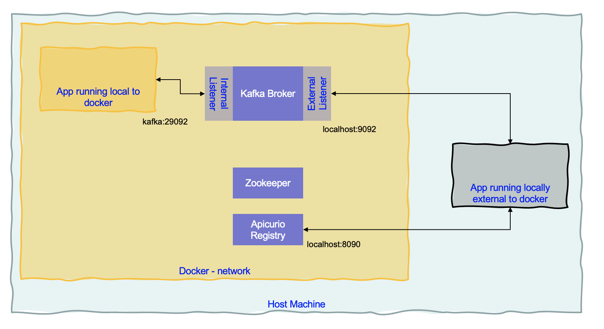
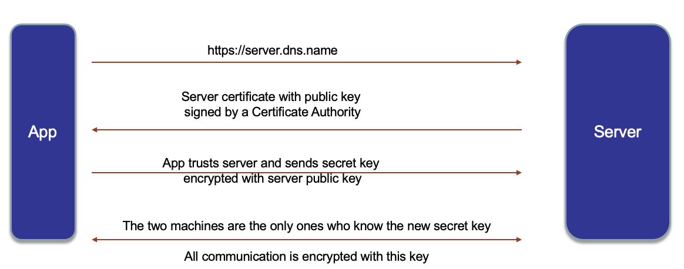

# Apache Kafka Studies

This repository regroups a set of personal studies and quick summaries on Kafka. 
Most of the curated contents are  defined in [the Kafka overview EDA article](https://ibm-cloud-architecture.github.io/refarch-eda/technology/kafka-overview/), 
and [the producer and consumer one](https://ibm-cloud-architecture.github.io/refarch-eda/technology/kafka-producers-consumers/)
but I want to reference all the good content I read from different studies. This is to build a body of knowledge.


## IBM content

* Developer ibm community: search kafka or event streams in [developer.ibm.com/](https://developer.ibm.com/)
* [Tutorial: User authentication and authorization in Apache Kafka](https://developer.ibm.com/tutorials/kafka-authn-authz/)
* [developer.ibm: Kafka fundamentals](https://developer.ibm.com/articles/event-streams-kafka-fundamentals)
* [developer.ibm: How persistence works in an Apache Kafka deployment](https://developer.ibm.com/articles/how-persistence-works-in-apache-kafka/)
* [Kafka articles in developer.ibm](https://developer.ibm.com/components/kafka/articles/)

## Running Kafka local

The docker compose in this repo, starts one zookeeper and one Kafka broker locally using last Strimzi release,  Apicurio for schema registry and Kafdrop for UI.

In the docker compose the Kafka defines two listeners, for internal communication using the DNS name `kafka` and port 29092 and one listener for external communication on port 9092.



A Quarkus app, for example, running with `quarkus:dev` will connect to localhost:9092. But a container in the same network needs to access kafka node. 

To start [kafkacat](https://hub.docker.com/r/edenhill/kafkacat) and [kafkacat doc to access sample consumer - producer](https://github.com/edenhill/kafkacat#examples)

```shell
docker run -it --network=host edenhill/kafkacat -b kafka:9092 -L
```

## Security summary

Review [this video to refresh SSL and TLS certificates](https://www.youtube.com/watch?v=T4Df5_cojAs) and keep in mind what the speaker quotes:

* Any message encrypted with Bob’s public key can only be decrypted with Bob’s private key
* Anyone with access to Alice’s public key can verify that a message could only have been created by someone with access to Alice’s private key.



For deep dive on security administration [see confluent article](https://docs.confluent.io/platform/current/security/general-overview.html) and [product documentation](http://kafka.apache.org/documentation/#security)
and Rick's blogs [Part 1](https://rosowski.medium.com/kafka-security-fundamentals-the-rosetta-stone-to-your-event-streaming-infrastructure-518f49640db4) and [Part 2](https://rosowski.medium.com/kafka-security-fundamentals-adding-tls-to-your-event-driven-utility-belt-432307f4ff62)

The Kafka client settings that are important:

* [security.protocol](http://kafka.apache.org/documentation/#adminclientconfigs_security.protocol)
For that verify how the listeners are configured in Kafka. The valid values are:

```sh
PLAINTEXT (using PLAINTEXT transport layer & no authentication - default value).
SSL (using SSL transport layer & certificate-based authentication)
SASL_PLAINTEXT (using PLAINTEXT transport layer & SASL-based authentication)
SASL_SSL (using SSL transport layer & SASL-based authentication)
```

In Strimzi the following yaml extract defines the listeners type and port: `tls` boolean is for the traffic encryption, while `authentication.type` will define the matching security protocol.

```yaml
listeners:
      - name: plain
        port: 9092
        type: internal
        tls: false
      - name: tls
        port: 9093
        type: internal
        tls: true
        authentication:
          type: tls
      - name: external
        type: route
        port: 9094
        tls: true 
        authentication:
          type: scram-sha-512
```

9093 is a mutual TLS authentication with TLS encrypted communication, while 9094 is using scram authentication and TLS encrypted communication

* `ssl.truststore.location` and `ssl.truststore.password`: when doing TLS encryption we need to provide our Kafka clients
 with the location of a trusted Certificate Authority-based certificate. This file is often provided by the 
 Kafka administrator and is generally unique to the specific Kafka cluster deployment. The certificate is in 
 JKS or PKCS12 format for JVM languages and PEM/ P12 for nodejs or Python.

Importing a certificate into one’s truststore also means trusting all certificates that are signed by that certificate.

To extract a PEM-based certificate from a JKS-based truststore, you can use the following command:

```sh
keytool -exportcert -keypass {truststore-password} -keystore {provided-kafka-truststore.jks} -rfc -file {desired-kafka-cert-output.pem}
```

To build a PKCS12 from a pem do

```sh
openssl pkcs12 -export -in cert.pem -out cert.p12
# if you want jks
keytool -importkeystore -srckeystore cert.p12 -srcstoretype pkcs12 -destkeystore cert.jks
```

* [sasl.mechanism](http://kafka.apache.org/documentation/#adminclientconfigs_sasl.mechanism) for authentication protocol used. Possible values are:

```
PLAIN (cleartext passwords, although they will be encrypted across the wire per security.protocol settings above)
SCRAM-SHA-512 (modern Salted Challenge Response Authentication Mechanism)
GSSAPI (Kerberos-supported authentication and the default if not specified otherwise)
```

* for java based app, the `sasl.jaas.config` strings is one of the following depending of the sasl.mechanism:

```
sasl.jaas.config = org.apache.kafka.common.security.plain.PlainLoginModule required username="{USERNAME}" password="{PASSWORD}";
sasl.jaas.config = org.apache.kafka.common.security.scram.ScramLoginModule required username="{USERNAME}" password="{PASSWORD}";
```

For **external connection** to Strimzi cluster use the following, where USERNAME is a scram-user

```sh
bootstrap.servers={kafka-cluster-name}-kafka-bootstrap-{namespace}.{kubernetes-cluster-fully-qualified-domain-name}:443
security.protocol=SASL_SSL
sasl.mechanism=SCRAM-SHA-512
sasl.jaas.config=org.apache.kafka.common.security.scram.ScramLoginModule required username="{USERNAME}" password="{PASSWORD}";
ssl.truststore.location={/provided/to/you/by/the/kafka/administrator}
ssl.truststore.password={__provided_to_you_by_the_kafka_administrator__}
```

To get the user password get the user secret:

```shell
oc get secret scram-user -o jsonpath='{.data.admin_password}' | base64 --decode && echo ""
```

To get the Bootstrap URL use: 

```
export K_CLUSTER_NAME=mycluster
export BOOTSTRAP="$(oc get route ${K_CLUSTER_NAME}-kafka-bootstrap -o jsonpath='{.spec.host}'):443"
```

The `sasl.jaas.config` can come from an environment variable inside of a secret, but in fact it is already defined in the scram user in Strimzi:

```sh
oc get secret my-user -o json | jq -r '.data["sasl.jaas.config"]' | base64 -d -
```

* For internal communication, with PLAIN the setting is

```sh
bootstrap.servers={kafka-cluster-name}-kafka-bootstrap.{namespace}.svc.cluster.local:9093
security.protocol = SASL_PLAINTEXT (these clients do not require SSL-based encryption as they are local to the cluster)
sasl.mechanism = PLAIN
sasl.jaas.config = org.apache.kafka.common.security.plain.PlainLoginModule required username="{USERNAME}" password="{PASSWORD}";
```

* For internal authentication with mutual TLS the settings: The certificates are mounted into the pod:

```
bootstrap.servers={kafka-cluster-name}-kafka-bootstrap.{namespace}.svc.cluster.local:9093
security.protocol=SSL
ssl.truststore.location=/deployments/certs/server/ca.p12
ssl.truststore.password={__provided_to_you_by_kafka_administrator__}
ssl.keystore.location=/deployments/certs/user/user.p12
ssl.keystore.password={__extracted_from_generated_kafka_user_secret_with_key=user.password__}
```

Remember that if the application does not run in the same namespace as the kafka cluster then copy the secrets with something like

```sh
if [[ -z $(oc get secret ${TLS_USER} 2> /dev/null) ]]
then
   # As the project is personal to the user, we can keep a generic name for the secret
   oc get secret ${TLS_USER} -n ${KAFKA_NS} -o json | jq -r '.metadata.name="tls-user"' | jq -r '.metadata.namespace="'${YOUR_PROJECT_NAME}'"' | oc apply -f -
fi

if [[ -z $(oc get secret ${SCRAM_USER} 2> /dev/null) ]]
then
    # As the project is personal to the user, we can keep a generic name for the secret
    oc get secret ${SCRAM_USER} -n ${KAFKA_NS} -o json |  jq -r '.metadata.name="scram-user"' | jq -r '.metadata.namespace="'${YOUR_PROJECT_NAME}'"' | oc apply -f -
fi
```

### For Confluent

See [Rick Osowski's gist script](https://gist.github.com/osowski/6abf268e9d7ab521481cc35523bc50f6)

## Using Kafdrop

For Kafdrop configuration see the kafka properties and `startKafDrop.sh` in scripts folder.

To get the user password:

```shell
# Get certificate to put in truststore
oc get secret kafka-cluster-ca-cert -o jsonpath='{.data.ca\.p12}' | base64 --decode >./certs/kafka.p12
# Get certificate password
oc get secret kafka-cluster-ca-cert -o jsonpath='{.data.ca\.password}' | base64 --decode 
# Get user passwor from the jaas config
oc get secret scram-user -o jsonpath='{.data.sasl\.jaas\.config}' | base64 --decode && echo
```

Those results are set in the properties:

```properties
ssl.truststore.password=
username="scram-user" password="";
```

## Using Apicurio

Once started define a schema in json and upload it to the api: http://apicurio:8080/api. Here is an example of command:

Schema:
```
{   
    "namespace": "ibm.gse.eda.vaccine.orderoptimizer",
    "doc": "Avro data schema for Reefer events",
    "type":"record",
    "name":"Reefer",
    "fields":[
            {
                "name": "reefer_id",
                "type": "string",
                "doc": "Reefer container ID"
            },
            {
                "name": "status",
                "type": "string",
                "doc": "Reefer Container ID status. Could be an Enum"
            },
            {
                "name": "location",
                "type": "string",
                "doc": "Reefer container location"
            },
            {
                "name": "date_available",
                "type": "string",
                "doc": "Date when the inventory will be available"
            }
     ]
}
```

Upload it to schema registry

```shell 
curl -X POST -H "Content-type: application/json; artifactType=AVRO" \
   -H "X-Registry-ArtifactId: vaccine.reefers-value" \
   --data @${scriptDir}/../data/avro/schemas/reefer.avsc http://localhost:8080/api/artifacts
```


## This repository content

Outside of my personal notes, some folders include running Apps:

* [python-kafka](https://github.com/jbcodeforce/kafka-studies/tree/master/python-kafka) for simple reusable code for event consumer and producer with python.
* [Kafka Vertx starter code](https://github.com/jbcodeforce/kafka-studies/tree/master/kafka-java-vertx-starter-1.0.0) from the event streams team, within one app to test a deployed event stream deployment
* [vertx consumer and producer](https://github.com/jbcodeforce/kafka-studies/tree/master/vertx-kafka) as separate quarkus apps.


## Source of information

* [Our event driven reference architecture content](https://ibm-cloud-architecture.github.io/refarch-eda/)
* [Container shipment solution](https://ibm-cloud-architecture.github.io/refarch-kc/)
* [Start by reading Kafka introduction - a must read!](https://Kafka.apache.org/intro/)
* [IBM Event Streams Product Documentation](https://ibm.github.io/event-streams)

* [Another introduction from Confluent, one of the main contributors of the open source.](http://www.confluent.io/blog/introducing-Kafka-streams-stream-processing-made-simple)

* [Planning event streams installation](https://ibm.github.io/event-streams/installing/planning/)
* [Develop Stream Application using Kafka](https://Kafka.apache.org/15/documentation/streams/)
* [Tutorial on access control, user authentication and authorization from IBM.](https://developer.ibm.com/tutorials/kafka-authn-authz/)
* [Kafka on Kubernetes using stateful sets](https://github.com/kubernetes/contrib/tree/master/statefulsets/Kafka)
* [IBM Developer article - learn kafka](https://developer.ibm.com/messaging/event-streams/docs/learn-about-Kafka/)
* [Using Kafka Connect to connect to enterprise MQ systems - Andrew Schofield](https://medium.com/@andrew_schofield/using-kafka-connect-to-connect-to-enterprise-mq-systems-5674d53fe55e)
* [Does Apache Kafka do ACID transactions? - Andrew Schofield](https://medium.com/@andrew_schofield/does-apache-kafka-do-acid-transactions-647b207f3d0e)
* [Spark and Kafka with direct stream, and persistence considerations and best practices](http://aseigneurin.github.io/2016/05/07/spark-Kafka-achieving-zero-data-loss.html)
* [Example in scala for processing Tweets with Kafka Streams](https://www.madewithtea.com/processing-tweets-with-Kafka-streams.html)

## Kafka programming

* [Producer & Consumer considerations](https://ibm-cloud-architecture.github.io/refarch-eda/technology/kafka-producers-consumers/)
* [Multithreading consumer study note from confluent]()

### Event streams

Product documentation to access event streams.

* Event streams / kafka on OpenShift with TLS connection on external route. We need the following quarkus properties:

 ```shell
 # get environment variables from configmap
 quarkus.openshift.env.configmaps=vaccine-order-ms-cm
 # use docker compose kafka
 %dev.kafka.bootstrap.servers=kafka:9092
 ```

 with matching config map

 ```yaml
apiVersion: v1
kind: ConfigMap
metadata:
  name: vaccine-order-ms-cm
data:
  KAFKA_BOOTSTRAP_SERVERS: eda-dev-kafka-bootstrap-eventstreams.gse-eda-2021-1-0143c5dd31acd8e030a1d6e0ab1380e3-0000.us-east.containers.appdomain.cloud:443
  KAFKA_SSL_PROTOCOL: TLSv1.2
  KAFKA_USER: scram
  KAFKA_SSL_TRUSTSTORE_LOCATION: /deployments/certs/server/ca.p12
  KAFKA_SSL_TRUSTSTORE_TYPE: PKCS12
  SHIPMENT_PLAN_TOPIC: vaccine_shipment_plans
  KAFKA_SASL_MECHANISM: SCRAM-SHA-512
  KAFKA_SECURITY_PROTOCOL: SASL_SSL
 ```

 and secrets

 ```
 ```

See example in project []()

## Kafka Connect with Debezium

## Kafka with Quarkus

Here is a template code for quarkus based Kafka consumer: [quarkus-event-driven-consumer-microservice-template](https://github.com/jbcodeforce/quarkus-event-driven-consumer-microservice-template).

Read this interesting guide with Quarkus and kafka streaming: [Quarkus using Kafka Streams](https://quarkus.io/guides/kafka-streams), which is implemented in the quarkus-reactive-msg producer, aggregator folders.

To generate the starting code for the producer we use the quarkus maven plugin with kafka extension:
`mvn io.quarkus:quarkus-maven-plugin:1.12.2.Final:create -DprojectGroupId=jbcodeforce.kafka.study -DprojectArtifactId=producer -Dextensions="kafka"`

for the aggregator:

`mvn io.quarkus:quarkus-maven-plugin:1.12.2.Final:create -DprojectGroupId=jbcodeforce.kafka.study -DprojectArtifactId=aggregator -Dextensions="kafka-streams,resteasy-jsonb"`

Interesting how to generate reference value to a topic with microprofile reactive messaging. `stations` is a hash:

```java
    @Outgoing("weather-stations")                               
    public Flowable<KafkaRecord<Integer, String>> weatherStations() {
        List<KafkaRecord<Integer, String>> stationsAsJson = stations.stream()
            .map(s -> KafkaRecord.of(
                    s.id,
                    "{ \"id\" : " + s.id +
                    ", \"name\" : \"" + s.name + "\" }"))
            .collect(Collectors.toList());

        return Flowable.fromIterable(stationsAsJson);
    };
```

Channels are mapped to Kafka topics using the Quarkus configuration file `application.properties`.

To build and run:

```shell
# under producer folder
docker build -f src/main/docker/Dockerfile.jvm -t quarkstream/producer-jvm .
# under aggregator folder
docker build -f src/main/docker/Dockerfile.jvm -t quarkstream/aggregator-jvm .
# Run under quarkus-reactive-msg
docker-compose up
# Run kafkacat
docker run --tty --rm -i --network kafkanet debezium/tooling:1.0
$ kafkacat -b kafka1:9092 -C -o beginning -q -t temperatures-aggregated
```

## Kafka with Apache Camel 3.0