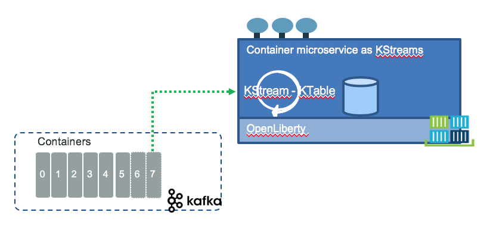
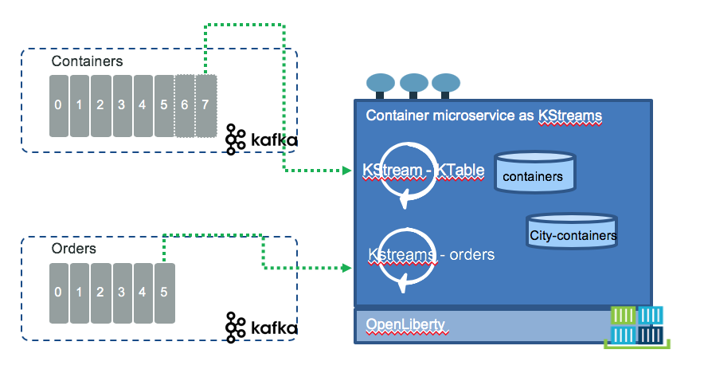

# Kafka Streams examples

In this article we are presenting how to use the Kafka Streams API combined with Kafka event sourcing to implement different interesting use cases.

The use cases are implemented inside the kstreams-play java project as unit tests.  Some of the domain classes are defined in the `src/java` folder. Streams topology are done in the unit test but could also be part of a service class to be used as an example running with kafka.

## Lab 1: mask credit card number

Using a simple kstream to change data on the fly, like for example encrypt a credit card number. Test is [EncryptCreditCardTest](). This is the first test to use the TopologyTestDriver class to run business logic outside of kafka. The class uses org.apache.kafka.common.serialization.Serdes and String serdesm and a JSON serdes for the domain class Purchase.

The other interesting approach is to use domain object with builder class and DSL to define the model:

```java
Purchase.builder(p).maskCreditCard().build()
```


## Joining 3 streams with reference data to build a document

This is a simple example of joining 3 sources of kafka streams to build a merged document, with some reference data loaded from a topic:

* The shipment status is a reference table and loaded inside a kafka topic: shipment-status
* The order includes items and customer id reference
* Customer is about the customer profile
* Products is about products inventory. 
* The outcome is an order report document that merge most of the attributes of the 3 streams.


## Refarch container the container inventory management implementation

The component can be represented in the figure below:



For getting started with Kafka Streams API read [this tutorial](https://kafka.apache.org/documentation/streams/).

The container topics includes all the events about a refrigerator container life cycle. The application is Java based and deployed in Liberty packaged into a docker image deployable on Kubernetes. The service exposes some RESTful APIs to get a container by ID. No CUD operations are defined as all those operations are done via events. The Streams implementation keeps data in Ktable.

As a java based microservice we have two approaches to implement the service: springboot and microprofile. Knowing we will deploy on kubernetes cluster with Istio we will have a lot of the resiliency and scalability addressed for us. [Microprofile](https://microprofile.io/) adds a lot of nice capabilities like SSL, open API, JAXRS, injection, metrics... we can leverage for this application. Microprofile is supported by Open Liberty as well as many servers.

The [Apache Kafka Streams API](https://kafka.apache.org/documentation/streams/) is a client library for building applications and microservices, where the input and output data are stored in Kafka clusters. It simplifies the implementation of the stateless or stateful event processing to transform and enrich data. It supports time windowing processing.

We encourage to do [this Streams tutorial](https://kafka.apache.org/21/documentation/streams/tutorial). 

The features we want to illustrate in this implementation, using KStreams are:

* Listen to ContainerAddedToInventory event from the `containers` topic and maintains a stateful table of containers. 
* Listen to OrderCreated event from `orders` and assign a container from the inventory based on the pickup location and the container location and its characteristics.
* Implemented as JAXRS application deployed on Liberty and packaged with dockerfile.
* Deploy to kubernetes or run with docker-compose

## Some useful Kafka streams APIs

The stream configuration looks similar to the Kafka consumer and producer configuration. 

```java
    props.put(StreamsConfig.APPLICATION_ID_CONFIG, "container-streams");
    props.put(StreamsConfig.BOOTSTRAP_SERVERS_CONFIG, "localhost:9092");    
    props.put(StreamsConfig.DEFAULT_KEY_SERDE_CLASS_CONFIG, Serdes.String().getClass());
    props.put(StreamsConfig.DEFAULT_VALUE_SERDE_CLASS_CONFIG, Serdes.String().getClass());
```

The StreamsConfig is a specific configuration for Streams app.  

One of the interesting class is the `KStream` to manage a stream of structured events. Kstreams represents unbounded collection of immutable events.

Two classes are supporting the order and container processing:

* [ContainerInventoryView](https://github.com/ibm-cloud-architecture/refarch-kc-container-ms/blob/master/kstreams/src/main/java/ibm/labs/kc/streams/containerManager/ContainerInventoryView.java)
* [ContainerOrderAssignment](https://github.com/ibm-cloud-architecture/refarch-kc-container-ms/blob/master/kstreams/src/main/java/ibm/labs/kc/streams/containerManager/ContainerOrderAssissgnment.java)

We are using the Streams DSL APIs to do the processing. Here is an example of terminal stream to print what is coming to the `orders` topic:

```java
   final StreamsBuilder builder = new StreamsBuilder();
    builder.stream("orders")
        .foreach((key,value) -> {
        			Order order = parser.fromJson((String)value, OrderEvent.class).getPayload();
        			// TODO do something to the order
        			System.out.println("received order " + key + " " + value);
        		});

    final Topology topology = builder.build();
    final KafkaStreams streams = new KafkaStreams(topology, props);
    streams.start();
```

We want now to implement the container inventory. We want to support the following events:

* ContainerAddedToInventory, ContainerRemovedFromInventory
* ContainerAtLocation
* ContainerOnMaintenance, ContainerOffMaintenance,
* ContainerAssignedToOrder, ContainerReleasedFromOrder
* ContainerGoodLoaded, ContainerGoodUnLoaded
* ContainerOnShip, ContainerOffShip
* ContainerOnTruck, ContainerOffTruck

We want the container event to keep a timestamp, a version, a type, and a payload representing the data describing a Reefer container. The Key is the containerID. The java class for the container event is [here](https://github.com/ibm-cloud-architecture/refarch-kc-container-ms/blob/master/kstreams/src/main/java/ibm/labs/kc/model/events/ContainerEvent.java).

Using a TDD approach we will start by the tests to implement the solution.

For more information on the Streams DSL API, [keep this page close to you](https://kafka.apache.org/21/documentation/streams/developer-guide/dsl-api.html). 

## Test Driven Development

We want to document two major test suites. One for building the internal view of the container inventory, the other to support the container to order assignment.

### Container inventory

> When the service receives a ContainerAdded event it needs to add it to the table and be able to retreive it by ID

1. To support the Get By ID we are adding a Service class with the operation exposed as RESTful resource using JAXRS annotations. We already described this approach in the [fleetms project](https://github.com/ibm-cloud-architecture/refarch-kc-ms).

To test a stream application without Kafka backbone there is a test utility available [here](https://kafka.apache.org/documentation/streams/developer-guide/testing.html#unit-testing-processors). The settings are simple: get the properties, define the serialisation of the key and value of the event to get from kafka, define the stream process flow, named topology, send the input and get the output.

The [test TestContainerInventory](https://github.com/ibm-cloud-architecture/refarch-kc-container-ms/blob/master/kstreams/src/test/java/ut) is illustrating how to use the [TopologyTestDriver](https://kafka.apache.org/21/javadoc/org/apache/kafka/streams/TopologyTestDriver.html).

```java
	Properties props = ApplicationConfig.getStreamsProperties("test");
	props.put(StreamsConfig.BOOTSTRAP_SERVERS_CONFIG, "dummy:1234");
	TopologyTestDriver testDriver = new TopologyTestDriver(
				buildProcessFlow(), props);

	ConsumerRecordFactory<String, String> factory = new ConsumerRecordFactory<String, String>("containers",
				new StringSerializer(), new StringSerializer());
	ConsumerRecord<byte[],byte[]> record = factory.create("containers",ce.getContainerID(), parser.toJson(ce));
		
	testDriver.pipeInput(record);
```

We are using the String default serialization for the key and the ContainerEvent, and use Gson to serialize and deserialize the json.

So the test is to prepare a ContainerEvent with type = "ContainerAdded" and then get the payload, persist it in the table and access to the table via the concept of `store` and validate the data.

Below is the access to the store and compare the expected results

```java
	KeyValueStore<String, String> store = testDriver.getKeyValueStore("queryable-container-store");
	String containerStrg = store.get(ce.getContainerID());
	Assert.assertNotNull(containerStrg);
	Assert.assertTrue(containerStrg.contains(ce.getContainerID()));
	Assert.assertTrue(containerStrg.contains("atDock"));
```

Now the tricky part is in the Stream process flow. The idea is to process the ContainerEvent as streams (of String) and extract the payload (a Container), then generate the Container in a new stream, group by the key and then save to a table. We separate the code in a function so e can move it into the real application after.

```java
	public  Topology buildProcessFlow() {
		final StreamsBuilder builder = new StreamsBuilder();
	   // containerEvent is a string, map values help to change the type and data of the inpit values
	    builder.stream(CONTAINERS_TOPIC).mapValues((containerEvent) -> {
	    		 // the container payload is of interest to keep in table
	   			 Container c = jsonParser.fromJson((String)containerEvent, ContainerEvent.class).getPayload();
	   			 return jsonParser.toJson(c);
	   		 }).groupByKey()  // the keys are kept so we can group by key to prepare for the tabl
	   		 	.reduce((container,container1) -> {
	   		 		System.out.println("received container " + container1 );
	   		 		return container1;
	   		 	},
					 Materialized.as("queryable-container-store"));
	    return builder.build();
	}
```

The trick is to use the `reduce()` function that get the container and save it to the store that we can specify.

The unit test runs successfully with the command: `mvn -Dtest=TestContainerInventory test`.

This logic can be integrated in a View class. So we can refactor the test and add new class (see ContainerInventoryView class) to move the logic into the applciation. From a design point of view this class is a DAO. Now that we are not using the Testing tool, we need the real streams.

In class ContainerInventoryView:

```java 
   private KafkaStreams streams;
   // ..
	Properties props = ApplicationConfig.getStreamsProperties("container-streams");
	props.put(ConsumerConfig.AUTO_OFFSET_RESET_CONFIG, "earliest");
	streams = new KafkaStreams(buildProcessFlow(), props);
	try {
		streams.cleanUp(); 
		streams.start();
	} catch (Throwable e) {
		System.exit(1);
	}
```

As illustrated above, the streams API is a continuous running Thread, so it needs to be started only one time. We will address scaling separatly.  So we isolate the DAO as a Singleton, and start it when the deployed application starts, via a ServletContextListener. 

```java
public class EventLoop implements ServletContextListener{

	@Override
	public void contextInitialized(ServletContextEvent sce) {
		// Initialize the Container consumer
		ContainerInventoryView cView = (ContainerInventoryView)ContainerInventoryView.instance();
		cView.start();
	}
```

 Now we can add the getById operation, package as a war, deploy it to Liberty. 

### Container to Order Assignment

The business logic we want to implement is to get an order with the source pickup city, the type of product, the quantity and the expected pickup date, manage the internal list of containers and search for a container located close to the pickup city from the order.

The test to validate this logic is under `kstreams/src/test/java/ut/TestContainerAssignment`. 

The story will not be completed if we do not talk about how th application get the order. As presented in the design and [order command microservice](https://github.com/ibm-cloud-architecture/refarch-kc-order-ms) implementation, when an order is created an event is generated to the `orders` topic. So we need to add another Streams processing and start the process flow in the context listener.



### Run tests

Recall with maven we can run all the unit tests, one test and skip integration tests.

```shell
# Test a unique test
$  mvn -Dtest=TestContainerInventory test
# Skip all tests
mvn install -DskipTests
# Skip integration test
mvn install -DskipITs
# Run everything
mvn install
```

## How streams flows are resilient?

Specifying the replicas factor at the topic level, with a cluster of kafka brokers, combine with transactional event produce, ensure to do not lose messages. The producer client code has the list of all the brokers to contact in case of failure and will try to connect to any broker in the list. 

## How to scale?


## Further readings

* [Kafka Streams’ Take on Watermarks and Triggers](https://www.confluent.io/blog/kafka-streams-take-on-watermarks-and-triggers/) what continuous refinement with operational parameters means: 