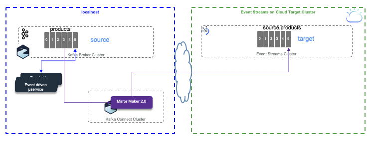
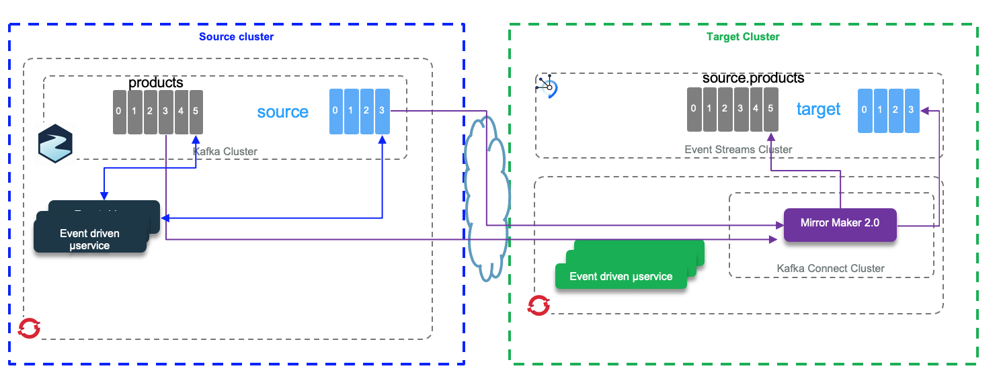

# Mirror Maker 2.0 Studies

Mirror Maker 2.0 is the new replication feature of Kafka 2.4. In this note we are presenting different test scenario for topic replication. 

* Replicate from local cluster to Event Streams on Cloud (See detail [in the scenario 1 section](#scenario-1-from-kafka-local-as-source-to-event-streams-on-cloud-as-target))
* Replicate from [Strimzi](https://strimzi.io/) 'local' Kafka cluster running on OpenShift to Event Streams on Cloud. (See detail [in the scenario 2 section](#scenario-2-run-mirror-maker-2-cluster-close-to-target-cluster))
* Replicate from [Event Streams on cloud being the source cluster to local Kafka cluster](#scenario-3-from-event-streams-to-local-cluster) running on local machine (started via docker-compose) using Strimzi Kafka docker image.

The `mirror-maker-2` folder includes, scripts, code and configurations to support the testing.

## Pre-requisites

* You need to have one Event Streams service on IBM Cloud.
* We may need to use Event Streams CLI. So follow [those instructions](https://cloud.ibm.com/docs/services/EventStreams?topic=eventstreams-cli#cli) to get it.

The following command presents the Event Stream cluster metadata, like broker list and cluster ID:

```shell
ibmcloud es cluster
```

For other CLI commands see [this summary](https://cloud.ibm.com/docs/services/EventStreams?topic=eventstreams-cli_reference).

* To run local cluster we use docker-compose and docker. The docker compose file to start a local 3 Kafka brokers and 2 Zookeepers cluster is in `mirror-maker-2/local-cluster` folder. This compose file uses a local docker network called `kafkanet`. The docker image used for Kafka is coming from Strimzi open source project and is for the Kafka 2.4 version.
* When the Event Streams service is created, add a service credentials and get the brokers list and api key information. We will use them in a setenv.sh script file under `mirror-maker-2` folder to define environment variables.

## General concepts

As [Mirror maker 2.0](https://strimzi.io/docs/master/#con-configuring-mirror-maker-deployment-configuration-kafka-mirror-maker) is using kafka Connect framework, we recommend to review our summary [in this note](https://ibm-cloud-architecture.github.io/refarch-eda/kafka/connect/). 

The figure below illustrates the mirror maker internal components running within Kafka Connect.


In distributed mode, Mirror Maker creates the following topics to the target cluster:

* mm2-configs.source.internal: This topic will store the connector and task configurations.
* mm2-offsets.source.internal: This topic is used to store offsets for Kafka Connect.
* mm2-status.source.internal: This topic will store status updates of connectors and tasks.
* source.heartbeats
* source.checkpoints.internal

A typical mirror maker configuration is done via property file and define source and target cluster with their connection properties and the replication flow definitions. Here is a simple example

```properties
clusters=source, target
source.bootstrap.servers=${KAFKA_SOURCE_BROKERS}
target.bootstrap.servers=${KAFKA_TARGET_BROKERS}
target.security.protocol=SASL_SSL
target.ssl.protocol=TLSv1.2
target.ssl.endpoint.identification.algorithm=https
target.sasl.mechanism=PLAIN
target.sasl.jaas.config=org.apache.kafka.common.security.plain.PlainLoginModule required username="token" password=${KAFKA_TARGET_APIKEY};
# enable and configure individual replication flows
source->target.enabled=true
source->target.topics=products
tasks.max=10
```

* White listed topics are set with the `source->target.topics` attribute of the replication flow and use [Java regular expression](https://www.vogella.com/tutorials/JavaRegularExpressions/article.html) syntax.
* Blacklisted topics: by default the following pattern is applied:

```properties
blacklist = [follower\.replication\.throttled\.replicas, leader\.replication\.throttled\.replicas, message\.timestamp\.difference\.max\.ms, message\.timestamp\.type, unclean\.leader\.election\.enable, min\.insync\.replicas]
```
but can be also specified with the properties: `topics.blacklist`. Comma-separated lists are also supported.

Internally `MirrorSourceConnector` and `MirrorCheckpointConnector` will
create multiple tasks (up to tasks.max), `MirrorHeartbeatConnector`
creates only one single task. `MirrorSourceConnector` will have one task per topic-partition to replicate, while `MirrorCheckpointConnector` will have one task per consumer group. The Kafka connect framework uses the coordinator API, with assign API and so there is no consumer group while fetching data from source topic. There is no call to commit() neither: the rebalancing occurs only when there is a new topic created that matches the whitelist pattern.

## Scenario 1: From Kafka local as source to Event Streams on Cloud as Target

The scenario is to send the products definition in the local `products` topic and then start mirror maker to see the data replicated to the `source.products` topic in Event Streams cluster.



* Set the environment variables in setenv.sh to source broker is your local cluster, and the target is event streams with its API KEY

```shell
export KAFKA_SOURCE_BROKERS=kafka1:9092,kafka2:9093,kafka3:9094

export KAFKA_TARGET_BROKERS=broker-3-qnprtqnp7hnkssdz.kafka.svc01.us-east.eventstreams.cloud.ibm.com:9093,broker-1-qnprtqnp7hnkssdz.kafka.svc01.us-east.eventstreams.cloud.ibm.com:9093,broker-0-qnprtqnp7hnkssdz.kafka.svc01.us-east.eventstreams.cloud.ibm.com:9093,broker-5-qnprtqnp7hnkssdz.kafka.svc01.us-east.eventstreams.cloud.ibm.com:9093,broker-2-qnprtqnp7hnkssdz.kafka.svc01.us-east.eventstreams.cloud.ibm.com:9093,broker-4-qnprtqnp7hnkssdz.kafka.svc01.us-east.eventstreams.cloud.ibm.com:9093
export KAFKA_TARGET_APIKEY="<password attribut in event streams credentials>"
```

* Create the target topics in the target cluster. The following topics needs to be created upfront in events streams as Access Control does not authorize program to create topic dynamically.

  ```
  cloudctl es topic-create -n mm2-configs.source.internal -p 1 -r 3 -c cleanup.policy=compact
  cloudctl es topic-create -n mm2-offsets.source.internal -p 25 -r 3 -c cleanup.policy=compact
  cloudctl es topic-create -n mm2-status.source.internal -p 5 -r 3 -c cleanup.policy=compact
  cloudctl es topic-create -n source.products -p 1 -r 3
  cloudctl es topic-create -n source.heartbeats -p 1 -r 3
  cloudctl es topic-create -n source.checkpoints.internal -p 1 -r 3 -c cleanup.policy=compact
  ```

* In one window terminal, start local cluster using docker-compose under the `mirror-maker-2/local-cluster` folder: `docker-compose up &`. The data are persisted on the local disk in this folder. 
* If this is the first time you started the cluster, you need to create the `products` topic. Start a Kafka container to access the Kafka tool with the command:

  ```shell
  docker run -ti -v $(pwd):/home --network kafkanet strimzi/kafka:latest-kafka-2.4.0 bash
  ```

  Then in the bash shell, go to `/home/local-cluster` folder and execute the script: `./createProductsTopic.sh`. Verify it is created with the command: `/opt/kafka/bin/kafka-topics.sh --bootstrap-server kafka1:9092 --list`

* Send some products data to this topic. For that we use a docker python image. The docker file to build this image is `Dockerfile-python` so the command build this image (if you change the image name be sure to use the new name in future command): `docker build -f Dockerfile-python -t jbcodeforce/python37 .`

  Once the image is built, start the python environment with the following commands:
  
  ```shell
  source ./setenv.sh
  docker run -ti -v $(pwd):/home --rm -e KAFKA_BROKERS=$KAFKA_SOURCE_BROKERS --network kafkanet jbcodeforce/python37   bash
  ```
  In the container bash shell do the following

  ```
  $ echo $KAFKA_BROKERS
  kafka1:9092,kafka2:9093,kafka3:9094
  $ python SendProductToKafka.py 

  [KafkaProducer] - {'bootstrap.servers': 'kafka1:9092,kafka2:9093,kafka3:9094', 'group.id': 'ProductsProducer'}
  {'product_id': 'P01', 'description': 'Carrots', 'target_temperature': 4, 'target_humidity_level': 0.4, 'content_type': 1}
  {'product_id': 'P02', 'description': 'Banana', 'target_temperature': 6, 'target_humidity_level': 0.6, 'content_type': 2}
  {'product_id': 'P03', 'description': 'Salad', 'target_temperature': 4, 'target_humidity_level': 0.4, 'content_type': 1}
  {'product_id': 'P04', 'description': 'Avocado', 'target_temperature': 6, 'target_humidity_level': 0.4, 'content_type': 1}
  {'product_id': 'P05', 'description': 'Tomato', 'target_temperature': 4, 'target_humidity_level': 0.4, 'content_type': 2}
  [KafkaProducer] - Message delivered to products [0]
  [KafkaProducer] - Message delivered to products [0]
  [KafkaProducer] - Message delivered to products [0]
  [KafkaProducer] - Message delivered to products [0]
  [KafkaProducer] - Message delivered to products [0]
  ```

* To validate the data are in the source topic we can use the console consumer. Here are the basic commands:
  
  ```shell
  docker run -ti -v $(pwd):/home --network kafkanet strimzi/kafka:latest-kafka-2.4.0 bash
  $ cd bin
  $ ./kafka-console-consumer.sh --bootstrap-server kafka1:9092 --topic products --from-beginning
  ```

* Define the event streams properties file for the tool command. The `eventstream.properties` file looks like:

```properties
bootstrap.servers=broker-3-qnprtqnp7hnkssdz.kafka.svc01.us-east.eventstreams.cloud.ibm.com:9093,broker-1-qnprtqnp7hnkssdz.kafka.svc01.us-east.eventstreams.cloud.ibm.com:9093,broker-0-qnprtqnp7hnkssdz.kafka.svc01.us-east.eventstreams.cloud.ibm.com:9093,broker-5-qnprtqnp7hnkssdz.kafka.svc01.us-east.eventstreams.cloud.ibm.com:9093,broker-2-qnprtqnp7hnkssdz.kafka.svc01.us-east.eventstreams.cloud.ibm.com:9093,broker-4-qnprtqnp7hnkssdz.kafka.svc01.us-east.eventstreams.cloud.ibm.com:9093
security.protocol=SASL_SSL
ssl.protocol=TLSv1.2
sasl.mechanism=PLAIN
sasl.jaas.config=org.apache.kafka.common.security.plain.PlainLoginModule required username="token" password=....;
```  

* Restart the `kafka-console-consumer` with the bootstrap URL to access to event streams and with the replicated topic: `source.products`. Use the previously created properties file to get authentication properties so the command looks like:

  ```shell
  source /home/setenv.sh
  ./kafka-console-consumer.sh --bootstrap-server $KAFKA_TARGET_BROKERS --consumer.config /home/eventstream.properties --topic source.products --from-beginning
  ```

* Now we are ready to start Mirror Maker 2.0 in a local docker image:

```shell
docker run -ti -v $(pwd):/home --network kafkanet strimzi/kafka:latest-kafka-2.4.0 bash
$ /home/local-cluster/launchMM2.sh
```

The trace includes a ton of messages, which demonstrate different consumers and producers, workers and tasks. The logs can be found in the `/tmp/logs` folder. The table includes some of the elements of this configuration:

| Name | Description |
| --- | --- |
| Worker clientId=connect-2, groupId=target-mm2 | Herder for target cluster topics but reading source topic|
| Producer clientId=producer-1 | Producer to taget cluster |
| Consumer clientId=consumer-target-mm2-1, groupId=target-mm2] | Subscribed to 25 partition(s): mm2-offsets.target.internal-0 to 24 | 
| Consumer clientId=consumer-target-mm2-2, groupId=target-mm2] | Subscribed to 5 partition(s): mm2-status.target.internal-0 to 4 |
| Consumer clientId=consumer-target-mm2-3, groupId=target-mm2] | Subscribed to partition(s): mm2-configs.target.internal-0 |
| Worker clientId=connect-2, groupId=target-mm2 . Starting connectors and tasks using config offset 6.|  This trace shows mirror maker will start to consume message from the offset 6. A previous run has already committed the offset for this client id. This illustrate a Mirror Maker restarts |
| Starting connector MirrorHeartbeatConnector and Starting task MirrorHeartbeatConnector-0  |  |
| Starting connector MirrorCheckpointConnector | |
| Starting connector MirrorSourceConnector | |

As expected, in the consumer console we can see the 5 product messages arriving after replication.

## Scenario 2: Run Mirror Maker 2 Cluster close to target cluster

So the scenario is similar in term of test as the scenario 1 but Mirror Maker runs within an OpenShift cluster in the same data center as Event Streams cluster.



We have created an Event Streams cluster on Washington DC data center. We have a Strimzi Kafka cluster defined in Washington data center in a OpenShift Cluster. As both clusters are in the same data center, we deploy Mirror Maker 2.0 close to target cluster (Event Streams on Cloud).


What needs to be done:

* Get a Openshift cluster in the same data center as Event Streams service.
* Create a project in OpenShift, for example: `MirrorMakerToES`.
* Deploy the Strimzi Kafka cluster and topic operators. See the sections on role binding, cluster operator, topic operator and user operator deployments from the [deployment note](strimzi-deploy.md).
* Define source and target cluster properties in mirror maker mm2.yaml file 

```
```

* Deploy Mirror maker 2.0 pod within this project

```
oc apply -f mm2-pod.yaml 
```


* Define a secret for the API key of the target cluster
`oc create secret generic es-apikey-target --from-literal=binding=am_`
* Start a producer (for example the below code send products reference data into products topic)

```shell
export KAFKA_PWD="replace-with-event-streams-apikey"
export KAFKA_BROKERS="..."
docker run -ti -v $(pwd):/home --rm -e KAFKA_PWD=$KAFKA_PWD -e KAFKA_BROKERS=$KAFKA_BROKERS jbcodeforce/python37   bash
python SendProductToKafka.py
```

* Define a source cluster properties file with truststore and bootstrap servers. This file is used for the different Kafka tools like kafka-topics.sh or console producer and consumer.

```properties
bootstrap.servers=....
security.protocol=SSL
ssl.truststore.password=password
ssl.truststore.location=/home/truststore.jks
```

and a target cluster property file:

```properties
bootstrap.servers=broker-3-q.kafka.svc01.us-east.eventstreams.cloud.ibm.com:9093,broker-4-q.kafka.svc01.us-east.eventstreams.cloud.ibm.com:9093
security.protocol=SASL_SSL
ssl.protocol=TLSv1.2
sasl.mechanism=PLAIN
sasl.jaas.config=org.apache.kafka.common.security.plain.PlainLoginModule required username="token" password="am_...";
```

* Start a product producer with a python client code

* Start a consumer locally on your compute using the Strimzi/kafka image.

```
docker run -ti -v $(pwd):/home strimzi/kafka:latest-kafka-2.4.0 bash
cd /opt/kafka/bin
./kafka-console-consumer.sh --bootstrap-server my-cluster-kafka-bootstrap-jb-kafka-strimzi.gse-eda-demos-fa9ee67c9ab6a7791435450358e564cc-0001.us-east.containers.appdomain.cloud:443 --consumer.config /home/strimzi.properties  --topic products
```

* Verify the created topics on target cluster (Event Streams)

```shell
/opt/kafka/bin/kafka-topics.sh --bootstrap-server $KAFKA_BROKERS --command-config /home/eventstream.properties --list
```
* In case you need it... looking at source cluster topic list:

```
/opt/kafka/bin/kafka-topics.sh --bootstrap-server my-cluster-kafka-bootstrap-jb-kafka-strimzi.gse-eda-demos-fa9ee67c9ab6a7791435450358e564cc-0001.us-east.containers.appdomain.cloud:443 --command-config /home/strinzi.properties --list 
```

Get detail on one topic:

```
/opt/kafka/bin//kafka-topics.sh --bootstrap-server my-cluster-kafka-bootstrap-jb-kafka-strimzi.gse-eda-demos-fa9ee67c9ab6a7791435450358e564cc-0001.us-east.containers.appdomain.cloud:443  --command-config /home/strimzi.properties --describe --topic products
```


## Scenario 3: From Event Streams to local cluster

For the first test the source is Event Streams on IBM Cloud and the target is a local server (may be on a laptop using Kafka strimzi images started with docker compose)


This time the producer adds headers and message and Mirror maker need to get the APIkey, so the mirror-maker.properties looks like:

```properties
clusters=source, target
source.bootstrap.servers=broker-3-qnprtqnp7hnkssdz.kafka.svc01.us-east.eventstreams.cloud.ibm.com:9093,broker-1-qnprtqnp7hnkssdz.kafka.svc01.us-east.eventstreams.cloud.ibm.com:9093,broker-0-qnprtqnp7hnkssdz.kafka.svc01.us-east.eventstreams.cloud.ibm.com:9093,broker-5-qnprtqnp7hnkssdz.kafka.svc01.us-east.eventstreams.cloud.ibm.com:9093,broker-2-qnprtqnp7hnkssdz.kafka.svc01.us-east.eventstreams.cloud.ibm.com:9093,broker-4-qnprtqnp7hnkssdz.kafka.svc01.us-east.eventstreams.cloud.ibm.com:9093
source.security.protocol=SASL_SSL
source.ssl.protocol=TLSv1.2
source.sasl.mechanism=PLAIN
source.sasl.jaas.config=org.apache.kafka.common.security.plain.PlainLoginModule required username="token" password="985...";
target.bootstrap.servers=kafka1:9092,kafka2:9093,kafka3:9094
# enable and configure individual replication flows
source->target.enabled=true
source->target.topics=orders
```


We have created an Event Streams cluster on Washington DC data center. We have a Strimzi Kafka cluster defined in Washington data center in a OpenShift Cluster. As both clusters are in the same data center, we deploy Mirror Maker 2.0 close to target cluster (Event Streams on Cloud).


## Scenario 4: From Event Streams On Cloud to Strimzi Cluster on Openshift


## Scenario 5: From Kafka cluster on Openshift cluster to local cluster


The source cluster is a Strimzi cluster running on Openshift as a service on IBM Cloud. It was installed following the instructions [documented here](https://ibm-cloud-architecture.github.io/refarch-eda/deployments/strimzi/deploy/).

The target cluster is also based on Strimzi kafka 2.4 docker image, but run in a local host, with docker compose. It starts two zookeeper nodes, and three kafka nodes. We need 3 kafka brokers as mirror maker created topics with a replication factor set to 3.

* Start the target cluster runnning on your laptop using:

    ```
    docker-compose up
    ```

* Start [mirror maker2.0](https://cwiki.apache.org/confluence/display/KAFKA/KIP-382%3A+MirrorMaker+2.0): 

    By using a new container, start another kakfa 2.4+ docker container, connected to the  brokers via the `kafkanet` network, and mounting the configuration in the `/home`:

    ```shell
    docker run -ti --network kafkanet -v $(pwd):/home strimzi/kafka:latest-kafka-2.4.0 bash
    ```

    Inside this container starts mirror maker 2.0 using the script: `/opt/kakfa/bin/connect-mirror-maker.sh`

    ```shell
    /opt/kakfa/bin/connect-mirror-maker.sh /home/strimzi-mm2.properties
    ```

    The `strimzi-mm2.properties` properties file given as argument defines the source and target clusters and the topics to replicate:

    ```properties
    clusters=source, target
    source.bootstrap.servers=my-cluster-kafka-bootstrap-jb-kafka-strimzi.gse-eda-demos-fa9ee67c9ab6a7791435450358e564cc-0001.us-east.containers.appdomain.cloud:443
    source.security.protocol=SSL
    source.ssl.truststore.password=password
    source.ssl.truststore.location=/home/truststore.jks
    target.bootstrap.servers=kafka1:9092,kafka2:9093,kafka3:9094
    # enable and configure individual replication flows
    source->target.enabled=true
    source->target.topics=orders
    ```

    As the source cluster is deployed on Openshift, the exposed route to access the brokers is using TLS connection. So we need the certificate and create a truststore to be used by those Java programs. All kafka tools are done in java or scala so running in a JVM, which needs truststore for keep trusted TLS certificates. 
    When running from a remote system to get the certificate do the following steps:

    1. Get the host ip address from the Route resource

        ```shell
        oc get routes my-cluster-kafka-bootstrap -o=jsonpath='{.status.ingress[0].host}{"\n"}'
        ```

    1. Get the TLS certificate from the broker

        ```shell
        oc get secrets
        oc extract secret/my-cluster-cluster-ca-cert --keys=ca.crt --to=- > ca.crt
        ```

    1. Transform the certificate fo java truststore

        ```shell
        keytool -import -trustcacerts -alias root -file ca.crt -keystore truststore.jks -storepass password -noprompt
        ```

    For Openshift or Kubernetes deployment, the mirror maker descriptor needs to declare the TLS stamza:

    ```yaml
    mirrors:
    - sourceCluster: "my-cluster-source"
    targetCluster: "my-cluster-target"
    sourceConnector:
      config:
        replication.factor: 1
        offset-syncs.topic.replication.factor: 1
        sync.topic.acls.enabled: "false"
    targetConnector:
      tls:
        trustedCertificates:
          - secretName: my-cluster-cluster-cert
            certificate: ca.crt
    ```

* The consumer may be started in second or third step. To start it, you can use a new container or use one of the running kafka broker container. Using the `Docker perspective` in Visual Code, we can get into a bash shell within one of the Kafka broker container. The local folder is mounted to `/home`. Then the script, `consumeFromLocal.sh source.orders` will get messages from the replicated topic: `source.orders`

* Finally start the producer in another kafka broker shell

```shell
/home/produceToStrimzi.sh orders
```

## Typical errors in Mirror Maker 2 traces

* Plugin class loader for connector: 'org.apache.kafka.connect.mirror.MirrorCheckpointConnector' was not found.
* Error while fetching metadata with correlation id 2314 : {source.heartbeats=UNKNOWN_TOPIC_OR_PARTITION}:
    * Those messages may come from multiple reasons. One is the name topic is not created. In Event Streams topics needs to be created via CLI or User Interface. It can also being related to the fact the consumer polls on a topic that has just been created and the leader for this topic-partition is not yet available, you are in the middle of a leadership election.
    * The advertised listener may not be set or found.
* Exception on not being able to create Log directory: do the following: `export LOG_DIR=/tmp/logs`
* ERROR WorkerSourceTask{id=MirrorSourceConnector-0} Failed to flush, timed out while waiting for producer to flush outstanding 1 messages
* ERROR WorkerSourceTask{id=MirrorSourceConnector-0} Failed to commit offsets (org.apache.kafka.connect.runtime.SourceTaskOffsetCommitter:114)