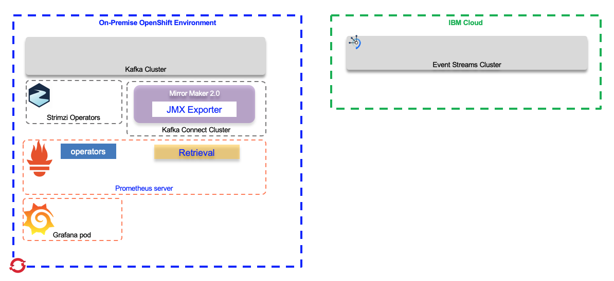

# Monitoring Mirror Maker and kafka connect cluster

The goal of this note is to go over some of the details on how to monitor Mirror Maker 2.0 metrics to Prometheus and how to use Grafana dashboard.

[Prometheus](https://prometheus.io/docs/introduction/overview/) is an open source systems monitoring and alerting toolkit that, with Kubernetes, is part of the Cloud Native Computing Foundation. It can monitor multiple workloads but is normally used with container workloads. 

Here is simple diagram to explain prometheus generic architecture from their main website:


In the context of data replication between kafka cluster, what we want to monitor the mirror maker 2.0 metrics:



In order to run the example Grafana dashboards to monitor MM2, you must:

1. Add metrics configuration to your Kafka cluster resources (Mirror Maker 2.0)
2. Deploy Prometheus and optionally Prometheus Alertmanager
3. Deploy Grafana

For the interest of monitoring we can add Kafka Exporter to assess the consumer lag.

## Installation and configuration

Prometheus deployment inside Kubernetes uses operator as defined in [the coreos github](https://github.com/coreos/prometheus-operator). The CRDs define a set of resources. The ServiceMonitor, PodMonitor, PrometheusRule are used.

Inside the [Strimzi github repository](https://github.com/strimzi/strimzi-kafka-operator), we can get a [prometheus.yml](https://github.com/strimzi/strimzi-kafka-operator/blob/master/examples/metrics/prometheus-install/prometheus.yaml) file to deploy prometheus server. This configuration defines, ClusterRole, ServiceAccount, ClusterRoleBinding, and the Prometheus resource instance. 
*For your own deployment you have to change the target namespace, and the rules*

You need to deploy Prometheus and all the other elements inside the same namespace or OpenShift project as the Kafka Cluster or the KafkaConnect Cluster.

To be able to monitor your own Kafka cluster you need to enable Prometheus metrics. An example of Kafka cluster Strimzi based deployment can be found [here](https://github.com/strimzi/strimzi-kafka-operator/blob/master/examples/metrics/kafka-metrics.yaml)


### Install Prometheus

* After creating a namespace or reusing the Kafka cluster namespace, you need to deploy the Prometheus operator by first downloading the different configuration yaml files:

    ```shell
    curl -s https://raw.githubusercontent.com/coreos/prometheus-operator/master/example/rbac/prometheus-operator/prometheus-operator-deployment.yaml | sed -e "s/namespace: default/namespace: jb-kafka-strimzi/" > prometheus-operator-deployment.yaml
    ```

    ```shell
    curl -s https://raw.githubusercontent.com/coreos/prometheus-operator/master/example/rbac/prometheus-operator/prometheus-operator-cluster-role.yaml > prometheus-operator-cluster-role.yaml
    ```

    ```shell
    curl -s https://raw.githubusercontent.com/coreos/prometheus-operator/master/example/rbac/prometheus-operator/prometheus-operator-cluster-role-binding.yaml | sed -e "s/namespace: default/namespace: jb-kafka-strimzi/" > prometheus-operator-cluster-role-binding.yaml
    ```

    ```shell
    curl -s https://raw.githubusercontent.com/coreos/prometheus-operator/master/example/rbac/prometheus-operator/prometheus-operator-service-account.yaml | sed -e "s/namespace: default/namespace: jb-kafka-strimzi/" > prometheus-operator-service-account.yaml
    ```

* Deploy the operator, cluster role, binding and service account (see files under `monitoring` folder):

    ```shell
    kubectl apply -f prometheus-operator-deployment.yaml
    kubectl apply -f prometheus-operator-cluster-role.yaml
    kubectl apply -f prometheus-operator-cluster-role-binding.yaml
    kubectl apply -f prometheus-operator-service-account.yaml
    ```

When you apply those configuration, the following resources are managed by the Prometheus Operator:

| Resource | Description | 
| --- | --- | 
|ClusterRole | To grant permissions to Prometheus to read the health endpoints exposed by the Kafka and ZooKeeper pods, cAdvisor and the kubelet for container metrics.|
| ServiceAccount | For the Prometheus pods to run under. |
| ClusterRoleBinding | To bind the ClusterRole to the ServiceAccount.|
| Deployment | To manage the Prometheus Operator pod. |
| ServiceMonitor | To manage the configuration of the Prometheus pod.|
| Prometheus | To manage the configuration of the Prometheus pod. |
| PrometheusRule | To manage alerting rules for the Prometheus pod. |
|  Secret | To manage additional Prometheus settings. |
| Service  | To allow applications running in the cluster to connect to Prometheus (for example, Grafana using Prometheus as datasource) |

* Deploy the prometheus server by first changing the namespace and may adapt [the original file](https://github.com/strimzi/strimzi-kafka-operator/blob/master/examples/metrics/prometheus-install/prometheus.yaml).

    ```shell
    curl -s  https://github.com/strimzi/strimzi-kafka-operator/blob/master/examples/metrics/prometheus-install/prometheus.yaml | sed -e "s/namespace: default/namespace: jb-kafka-strimzi/" > prometheus.yml

    kubectl apply -f prometheus-rules.yaml
    kubectl apply -f prometheus.yaml
    ```

The Prometheus server configuration uses service discovery to discover the pods in the cluster from which it gets metrics. 

### Install Grafana


## Mirror maker monitoring

## Configure Grafana dashboard