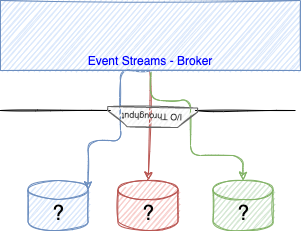

# Kafka Sizing Considerations

For any Kafka deploy we need to compute the number of brokers, connectors and replicators needed for production, staging and dev environments.

It is difficult to compute as Kafka has a lot of tuning factors and the needs are not easy to assess up front, during pre-sale configuration. The [tee shirt](#tee-shirt-sizing) size is the simplest approach in pre-sale but still some important considerations need to be evaluated.

Generally, disk throughput tends to be the main bottleneck in Kafka performance. However, that’s not to say that the network is never a bottleneck. Network throughput can affect Kafka’s performance if you are sending messages across data centers, if your topics have a large number of consumers, or if your replica followers are catching up to their leaders.  Depending on how you configure flush behavior you may or may not benefit from more expensive disks (if you force flush often then higher RPM SAS drives may be better).

But what can we still do for discussion?

## Context

As stipulated by the licensing rules we need to look at brokers, geo-replicator, Prod and DR and Kafka connector. The following figure illustrates a production deployment view with the needed components to size in the context of OpenShift or Kubernetes deployment.


* The top region (Region-west) is for production. It includes OpenShift platform with master nodes (not represented in the diagram) and worker nodes. The worker nodes presented in the figure do concern only the Kafka brokers (9 dedicated nodes) and Kafka connect cluster nodes (3) that may be shared with other workload like kafka stream applications.
* The east region is for Disaster Recovery and will have the same amount of Kafka broker nodes, they are running as they received data from the production platform.
* The Kafka connector nodes in the DR site, are running Geo-replicator, which is based on the Mirror Maker 2 Open Source project. This component runs in cluster and will have as many nodes as needed to move to data from production topics to target topics.

### Latency numbers every solution architect should know

Dr. Dean from Google reveals the length of typical computer operations in 2010. Some numbers are outdated as computers become faster and more powerful. However, those numbers should still be able to give us an idea of the fastness and slowness of different computer operations.

| Operation name	| Time |
| --- | --- |
| L1 cache reference	| 0.5 ns |
| L2 cache reference |	7 ns |
| Mutex lock/unlock	| 100 ns |
| Compress 1K bytes with Zippy	| 10,000 ns = 10 µs
| Send 2K bytes over 1 Gbps network |	20,000 ns = 20 µs
| Read 1 MB sequentially from memory |	250,000 ns = 250 µs
| Round trip within the same datacenter |	500,000 ns = 500 µs
| Disk seek |	10,000,000 ns = 10 ms |
| Read 1 MB sequentially from the network	| 10,000,000 ns = 10 ms |
| Read 1 MB sequentially from disk	| 30,000,000 ns = 30 ms | 
| Send packet CA (California) ->EU ->CA	| 150,000,000 ns = 150 ms |

???+ "Notes"
    * ns = nanosecond, µs = microsecond, ms = millisecond
    * 1 ns = 10^-9 seconds
    * 1 µs= 10^-6 seconds = 1,000 ns
    * 1 ms = 10^-3 seconds = 1,000 µs = 1,000,000 ns

## Tee shirt sizing

Once you selected the starting cluster topology it is important to continuously assess the performance of the cluster, and add capacity over time. Always consider adding enough spare capacity to withstanding an event affecting all brokers of an entire Availability Zone. 

Seimics includes a basic tee shirt cluster sizing tool. We want to update it to be more adapted to what a AWS deployment may looks like. We expect 3 availability zones, and a cluster deployed within one region for production and another one for DR. If on premise and there may no be any availability zone, so expect to get 3 racks, and so the number will be mapped to VM assign to different rack. 

See the first figure above for a typical topology.

* Consumer groups up to 10


| Component |  Small | Medium | Large |
| --- |  --- | --- | --- |
| Kafka Brokers | 4 x m5.xlarge ( 4 vCPU - 16GB) | 9 x m5.xlarge | 12 x m5.xlarge |
| Broker VPCs | 16 | 36 | 48 |
| Kafka Connector | 3 x c5.large (2 CPUs - 4 GB)| 3  x c5.large | 6 x c5.large|
| KConnect VPCs | 6 | 6 | 12 |
| DR Kafka Brokers | 4 x m5.xlarge ( 4 vCPU - 16G) | 9 x m5.xlarge | 12 x m5.xlarge |
| Broker VPCs | 16 | 36 | 48 | 
| DR Kafka Connector |6 | 6 | 12 |
| KConnect VPCs | 16 | 36 | 48 |
| DR Geo replication | 3 c5.large (2 CPUs - 4 GB) | 3  x c5.large | 6  x c5.large |
| Geo VPCs | 6 | 6 | 12|
| Zookeepers - not license| 3 c5.large (2 CPUs - 4 GB) | 5 | 5 | 
| **Grant Total VPCs** | **50** | **90** |  **132** | 

With m5.xlarge the expected max network throughput is:

To this nodes you need to add EBS and master nodes to the OpenShift cluster.


## Customer Assessment

We have enought concepts to discuss with architects. We need to know the following information for their target IT infrastructure. For that we sould try to work backward from their use case to determine the throughput, availability, durability, and latency requirements. Here are a set of questions to assess

* Are you planning to run on cloud provider or on your own hardware on-premise? If so do you have a characteristics of your hardware.

???- "Impacts"
    As seen previously, disk, network and machine characteristics are key factor. You can use the formula of total expected cluster throughput to present the impact on those hardware characteristics. With cloud providers there are for sure a lot of different VM profile, disk storage and network capacity. It is important to assess what the customer is actually provisioning.

* Number of producer applications and their expected throughput in Megabyte per second - peak and average time ?

???- "Impacts"
    This is major parameters for cluster sizing, as explained in the next section, the total throughput, impact performance, and disk sizing.

* What peak traffic really means ? It is important to assess how long is the peak, and how more data are sent.
* How many hours per day / days per week the traffic is sustained?
* Expected retention time ?  The longer the retention time, the more disk space is needed.
* Number of different consumer types (consumer group) ?

???- "Impacts"
    Bigger number of consumer groups will lead Kafka brokers to do a lot of processing, impacting the size of the memory and number of CPUs needed.

* Number of streaming apps?: this could be difficult to assess but a streaming app most likely will add topics, which may not have been seen by the customer.
* Cloud provider

???- "Impacts"
    This is mostly to assess the capability to select powerful virtual machine, storage area network or be able to connect disks directly to VMs.

* Do we need encrypted communication between apps in the same cluster: Turning on in-cluster encryption forces the brokers to encrypt and decrypt individual messages which results in additional CPU and memory bandwidth overhead.

???- "Impacts"
    Encrypting means using bigger machine for bigger CPUs. 

Assumptions you can share:

* each producer will have at least one topic
* each streaming will add one or more topic
* kafka connector add topics
* topics could have two strategies: delete or compact - It will be difficult for an architect to answer what they will use. Knowing that they will have both.
* replicas is defaulted to 3 and in-sync replicas to 2

Going into details will kill any simple estimations:

* retention time set to multiple days may not be necessary for all topics.
* each time we add a streaming application, we add a topic and we add files to volume.
* compression could be used to reduce payload size
* Each topic may have different retention, partition numbers, strategy...
* The I/O throughput is impacted by caching strategy...

## Deeper dive discussion

### Kafka Brokers 

#### Concepts

It is important to communicate clearly on the different elements that help to size a Kafka cluster. The following diagram presents all the needed concepts.


* On the left you will have different producer applications: any applications running Kafka Producer API, and Kafka source connectors.  Each of those application sends data which adds to the total throughput.
* The producer applications may be a change data capture agent in Kafka Connect (e.g. [Debezium](https://debezium.io/)), event-driven microservice apps or any Kafka source connectors. The list of producers is not exhaustive, this is used for illustration purpose.
* Producer's throughput is impacted by a lot of parameters, one of the most important is the level of write acknowledge expected. If producer apps expect all replicas to be completed (ack=-1), to ensure no data loss, the replica and in-sync replicas settings, for each topics, are becoming important. 
* The diagram above, illustrates the minimum cluster size for high availability to support 2 failure/network isolations. Normally at least 4 nodes are recommended, as during maintenance we always want to have 3 nodes active to ensure a good availability. 
* In the figure, each horizontal cylinders are topics / partitions. For example the red topic has 3 partitions.
* Each partition has replicas, and one broker is the partition leader (cylinder in standard color, while replicas are in sketch mode)
* As partitions are persisted as append logs on disk, they are different factors that affect performance: the storage bandwidth of the node on which Kafka Broker runs, and the performance of the disks attached to the node. Also to be efficient, the partition to disk need to be well balanced. The storage bandwidth needs to be well known as adding more disk on a saturated bandwidth will not help.

  { width="500" }

* With Cloud deployment, like AWS, the storage attached to an instance (EC2) is based on network block storage (EBS) so network throughput is also part of the equation. You may use a dedicated network between the EC2 instance and the EBS servers to isolate IO traffic. Each storage has limit on the size you can provision, therefore it is possible to run out of disk space. 
* The following figure illustrates the producer, broker operations in solution with producers sending records evenly to 3 partitions, with replica set to 3, and consumers reading from the last offset:

  { width="700" }

* Each partition is save in a unique disk, so if a partition increase in a disk, the node can run out of disk space even if there is space to other attached volumes.
* The number of consumer group impacts the broker throughput, as broker cpu will be used to manage the consumer group and partition allocation.
* The global throughput of your cluster will be the minimum between different elements as illustrated by the following formula:

$max\_cluster\_throughput = min($
$max(storage\_throughput) * nb\_brokers / replicas\_factor,$
$max(san\_network\_throughput) * nb\_brokers / replicas\_factor,$ 
$max(network\_throughput_ * nb\_brokers / (nb\_consumer \_groups + replicas\_factor-1))$

* In fact we should cap this number with a maximum percent like 80-85% of the max potential cluster throughput. In reality the cluster will process less than this theorical limit because producer may not send record well balanced and consumers can come and go.
* Kafka was optimized to build append log, so good sequential read. Also as it uses fsynch to flush the memory to disk via OS capability write is also sequential, which increase throughput. Which also means it is not limited by disk IOPS. Consumer apps reading from the last offset will read from the memory improving throughput too. But consumers that are slow will impact the overall cluster throughput as the broker will have to load data from disk, and page the records, impact existing cache. The following figure illustrates those concepts:

  

* As illustrated in previous figure, the throughput of the storage backend depends on the data that producers are sending directly to the broker plus the replication traffic the broker is receiving from its peers.

$$
storage\_throughput <= input\_throughput * nb\_brokers / replicas\_factor
$$

* Finally as we can see a 3 broker cluster will have the real potential throughput of only **one broker**, as other brokers are doing partition replications. Which means if we keep 3 replicas and 2 ISR then to scale above the IOPS of one broker, we need more disk per broker and then more brokers.

* The number of io thread to write to different disk are also limited by the number of CPUs. Below is an extract from the Event Streams cluster custom definition based on strimzi:

  ```yaml
  spec:
    strimziOverrides:
      kafka:
        config:
          log.cleaner.threads: 6
          num.io.threads: 8
          num.network.threads: 12
          num.replica.fetchers: 3
          offsets.topic.replication.factor: 3
          default.replication.factor: 3
          min.insync.replicas: 2
  ```

* Streaming applications consume messages, process them and to produce in new topic: most of the time prospect has not think about those new topics.
* Event Streams brokers run in Worker node in Kubernetes cluster. We can assume a 60-70% CPU utilization
* The broker runs as pod, and get their volume via PVC, Persistence Volume and storage class. 
* As brokers are pods, they will have [cpu/memory request and limit resources](https://strimzi.io/docs/operators/latest/configuring.html#con-common-configuration-resources-reference) contraint to behave well in kubernetes cluster. Here is an example of such resource constraint, but it is better to understand what is the underlying node capabilities. 

  ```yaml
      resources: 
        requests:
          memory: 8Gi
          cpu: "4"
        limits:
          memory: 48Gi
          cpu: "8"
  ```


* For Kafka, the following aspects of a deployment can impact the resources you need:

    * Expected total number of message per second and size of messages
    * The number of network threads handling messages (in the cluster configuration)
    * The number of io threads handling the write operations (in the cluster configuration)
    * The number of CPUs per node.
    * Buffer flush policies
    * The number of producers and consumers
    * The number of topics and partitions
    
As an example on cluster with 8 CPU, 32Gb node, we can have 16 threads for the io and 32 for the network.

* Kafka runs inside a JVM and uses an operating system page cache to store message data before writing to disk. The memory request for Kafka should fit the JVM heap and page cache.

* Worker node will run on physical node with multiple cores - Assumes 12 cores 48GB RAM. Remember that having bigger node will have a bigger impact to the overall cluster performance in case of failure, as more resources need to be re-allocated. On the other side, when using large node on cloud provider like AWS, we get better IO SAN (EBS) throughput, and event higher network throughput.
* In Kubernetes, each node will have a set of PVs mounted to it - We can try to limit one disk per core, but most of the time it goes less than that. 
* Let assume 2 TB per volume.
* On a node we may have 6 TB of disk, let say the max capacity will be at 85% so we have a capacity per node of 10.2 TB (1TB * .85 * 12).

* With OpenShift or Kubernetes the recommendation is to use block storage and technology like IBM Spectrum, Ceph, or OCS and configure the Broker to use JBOD

Recall that every broker is constrained by a particular resource (typically I/O) adding more partitions will not result in increased throughput. Instead, you need to add brokers to the cluster. So sizing will be linked to the number of disk, replicas, number of consumer groups and number of broker. With 3 brokers and 3 replicas and one disk attach per brokers the amount of data will be only 85% of 1/3 of the volume size, and throughput 1/3 of the IOPS of the disk. This is why the minimum should be 6 brokers.

There are other considerations when looking at the consumer profile:

* consumers that connect later to process older records, may lead the broker to load data from disk as most likely those records are not more in memory. The access will be non sequential read, which impact performance.
### Hardware considerations

With OpenShift or Kubernetes deployment a lot of things need to be addressed. First we assume we deploy in one region with at least three availability zones. The figure below illustrates a AWS deployment. The Master nodes are not represented, as Event Streams / Kafka brokers run in worker nodes. A dedicated network / subnet manage the traffic between EC2 instances. The diagram illustrates 9 brokers running as worker nodes on EC2 type (m5.4xlarge).


There are two ways to configure storage, using instance disks, and storage area network. The EC2 I class, is for instance storage and it achieves higher IOPS and disk throughput.


Here is an example of EC2 instance, oriented I/O (I3), with large capacity, which can be considered for production deployment:


It is important to note that in case of node failure, starting a new node, will lead to broker replication, which is part of the Kafka design, but still cost time to converge.

For SAN deployment, in AWS, EBS storage mounted to the EC2 instances. As the storage is externalized from the EC2 instance, in case of failure and recreation, the volume can be attached and the broker starts with less replication to complete.


Some EBS volume types, such as gp3, io2, and st1, also allow you to adapt the throughput and IOPS. With EBS the cluster throughput will be

$max\_cluster\_throughput = min($
$max(storage\_throughput) * nb\_brokers / replicas\_factor,$
$max(san\_network\_throughput) * nb\_brokers / replicas\_factor)$

Other SAN is to use dedicated kubernetes worker nodes using the `rook` operator for k8s and `ceph` cluster:


[Rook](https://rook.io/docs/rook/v1.9/Getting-Started/storage-architecture/#design) is a cloud native storage orchestrator, which abstract the management and monitoring of storage cluster. Rook turns storage software into self-managing, self-scaling, and self-healing storage services. It uses operators. [Ceph](https://ceph.io/) is a highly scalable distributed storage solution for block storage, object storage, and shared filesystems.
It uses its own replication mechanism, therefore will impact the overall sizing of Kafka cluster. It is not recommended to use such storage layer. 

The figure above illustrates the rook and ceph approach.

* Replica on a disk has data but also index file [See Kafka's doc on persistence](https://kafka.apache.org/08/documentation.html#persistence) which means the total size of the disk is 1.3 time greater than expected message volume.
* Need to compute the disk size requirement per partition. But if customer communicates on total throughput, partitioning will split this amount. Still consider overhead of indexing per partition.

For better performance and resilience, Strimzi recommends to use [JBOD storage.](https://strimzi.io/docs/operators/latest/configuring.html#ref-jbod-storage-str), so the configuration of the kafka broker looks like:

```yaml
    kafka:
      replicas: 9
      storage:
        type: jbod
        volumes:
        - id: 0  
          class: localblock-sc
          size: 2048Gi
          type: persistent-claim
        - id: 1 
          class: localblock-sc
          size: 2048Gi
          type: persistent-claim
```

Kafka team recommends using multiple drives to get good throughput and not sharing the same drives used for Kafka data with application logs or other OS filesystem activity to ensure good latency.

Kafka always immediately writes all data to the filesystem (`/var/lib/kafka/data/kafka-log_1`) and supports the ability to configure the flush policy that controls when data is forced out of the OS cache and onto disk using the flush.
With the JBOD, volumes will be used by the Kafka brokers as log directories mounted into the following path: `/var/lib/kafka/data-id/kafka-log_idx_`

Note that durability in Kafka does not require syncing data to disk, as a failed node will always recover from its replicas.

From AWS machine type can assume the EBS volume has a baseline throughput of 250 MB/sec from standard config and 1000 MBps for gp3 (SSD), io2 (provisioned IOPS SSD), or st1 (throughput optimized HDD) volume types. This means if we need more than a total thourghput of 200 MB/s (80% of 250) we need to add brokers to the cluster. Performance reports show a six-node cluster has almost double the throughput of the three-node cluster. Larger brokers have a higher network baseline throughput (up to 25 Gb/sec) and can therefore support more consumer groups reading from the cluster. There is no way to increase network throughput other than scaling up.

!!! note
    So as a conclusion we do not recommend to use ceph for Kafka volume, and attach directly disk to the machines used for brokers deployment or use EC2 optimized for EBS volume with good IOPS. 
    With strong elastic capacity like in AWS, it is relevant to select provisioned throughput using volume type io2.

For IBM storage class explanation and quality of service [see storage block note](https://cloud.ibm.com/docs/containers?topic=containers-vpc-block#vpc-block-reference) 
and [the storage class QOS](https://cloud.ibm.com/docs/containers?topic=containers-block_storage#block_storageclass_reference)
### Benchmark your disk

The linux tool to test IOPS is [fio](https://github.com/axboe/fio) (the Flexible IO Tester). In Kubernetes we can use an image and declare a PVC on the same storage class as Kafka cluster will use, and then run tests. We have defined such configuration in our gitops repositories:

* Update the [diskbench.yaml](https://github.com/ibm-cloud-architecture/eda-rt-inventory-gitops/blob/main/environments/rt-inventory-dev/env/base/diskbench.yaml) file from the [real time inventory gitops](https://github.com/ibm-cloud-architecture/eda-rt-inventory-gitops) with the storage class you are using for Event Streams.

  Be sure to test multiple disk sizes as most cloud providers price IOPS per GB provisioned. So a 4000Gi volume will perform better than a 1000Gi volume. 

* Claim the PVC and start the disk bench job with:

```sh
oc apply -f diskbench.yaml
```

* The Job runs a series of `fio` tests on the newly provisioned disk, currently there are 9 tests, 15s per test - total runtime is around 2.5 minutes

See the [Docker image for fio tool in dockerhub](https://registry.hub.docker.com/r/zayashv/dbench) for information on this container.

* Look at report:

```sh
oc logs -f job/dbench
```

Below is an example of `fio` report for tests on a ceph mounted disk on one of the CoC cluster:

```sh
# ... almost 100Mib/s of throughput, 1480 MB read during 15s - default block size is 4k
read: IOPS=25.3k, BW=98.7MiB/s (103MB/s)(1480MiB/15003msec)
# write almost 13Mb/s
write: IOPS=3249, BW=12.8MiB/s (13.4MB/s)(191MiB/15056msec)
WRITE: bw=12.8MiB/s (13.4MB/s), 12.8MiB/s-12.8MiB/s (13.4MB/s-13.4MB/s), io=191MiB (201MB), run=15056-15056msec
# read bandwidth
read: IOPS=2667, BW=334MiB/s (350MB/s)(5021MiB/15037msec)
# write
write: IOPS=528, BW=66.6MiB/s (69.8MB/s)(1004MiB/15090msec)
# Testing Read Latency...
read: IOPS=3820, BW=14.1MiB/s (15.7MB/s)(224MiB/15002msec)
# Write latency
write: IOPS=1291, BW=5166KiB/s (5290kB/s)(75.8MiB/15006msec)
# Testing Read/Write Mixed...  (may be sloser to what kafka brokers do)
read: IOPS=7489, BW=29.3MiB/s (30.7MB/s)(439MiB/15008msec)
write: IOPS=2516, BW=9.86MiB/s (10.4MB/s)(148MiB/15008msec)

==================
= Dbench Summary =
==================
Random Read/Write IOPS: 25.3k/3249. BW: 334MiB/s / 66.6MiB/s
Average Latency (usec) Read/Write: 1043.52/
Sequential Read/Write: 359MiB/s / 107MiB/s
Mixed Random Read/Write IOPS: 7489/2516
```

???+ "Interpret fio results"
    * [See this blog](https://tobert.github.io/post/2014-04-17-fio-output-explained.html) for extended detail, but to summarize:
      * sequential read/write are important  

* Be sure to clean your mess

```sh
oc delete -f diskbench.yaml
```

### Kafka performance testing

Let start by the configuration to study. Assess the Kafka Broker server.properties content which is under the `/opt/kafka/config` folder. 

```sh
# The number of threads that the server uses for receiving requests from the network and sending responses to the network
num.network.threads=3

# The number of threads that the server uses for processing requests, which may include disk I/O
num.io.threads=8
# Where data is persisted
log.dirs=/tmp/kafka-logs
# The number of threads per data directory to be used for log recovery at startup and flushing at shutdown.
# This value is recommended to be increased for installations with data dirs located in RAID array.
num.recovery.threads.per.data.dir=1
```

Consider looking at configurations which control the flush of data to disk. There are a few important trade-offs to consider:

* **Durability**: Unflushed data may be lost if you are not using replication.
* **Latency**: Very large flush intervals may lead to latency spikes when the flush does occur as there will be a lot of data to flush.
* **Throughput**: The flush is generally the most expensive operation, and a small flush interval may lead to excessive seeks.

The settings defines the flush policy to flush data after a period of time or every N messages (or both). This can be done globally and overridden on a per-topic basis

```sh
# The number of messages to accept before forcing a flush of data to disk
log.flush.interval.messages=10000
# The maximum amount of time a message can sit in a log before we force a flush
log.flush.interval.ms=1000
```

* Create a eda-perf-topic with 5 partitions and 3 replicas (example in []())

```sh
oc apply -f eda-perf-topic.yaml
```

Use internal producer perf test tool:

```sh
./kafka-producer-perf-test.sh --topic eda-perf-test --num-records 20000 --record-size 1000 --print-metrics --throughput 300 --producer-props bootstrap.servers=dev-kafka-bootstrap.rt-inventory-dev.svc:9092
```

* interesting metrics to look at:

```sh
producer-metrics:connection-count:{client-id=perf-producer-client}                              : 4.000

producer-metrics:incoming-byte-rate:{client-id=perf-producer-client}                            : 18259.896
producer-metrics:incoming-byte-total:{client-id=perf-producer-client}                           : 1192836.000

producer-metrics:io-ratio:{client-id=perf-producer-client}                                      : 0.042
producer-metrics:io-time-ns-avg:{client-id=perf-producer-client}                                : 51450.563
producer-metrics:io-time-ns-total:{client-id=perf-producer-client}                              : 3055959438.000
producer-metrics:io-wait-ratio:{client-id=perf-producer-client}                                 : 0.919
producer-metrics:io-wait-time-ns-avg:{client-id=perf-producer-client}                           : 1122985.600
producer-metrics:io-wait-time-ns-total:{client-id=perf-producer-client}                         : 59169150670.000
producer-metrics:io-waittime-total:{client-id=perf-producer-client}                             : 59169150670.000

producer-metrics:network-io-rate:{client-id=perf-producer-client}                               : 570.384
producer-metrics:network-io-total:{client-id=perf-producer-client}                              : 37198.000

producer-metrics:record-queue-time-avg:{client-id=perf-producer-client}                         : 0.095
producer-metrics:record-queue-time-max:{client-id=perf-producer-client}                         : 7.000
# record throughtput was set to 300 so simulator was close
producer-metrics:record-send-rate:{client-id=perf-producer-client}                              : 299.867
producer-metrics:record-send-total:{client-id=perf-producer-client}                             : 20000.000
producer-metrics:record-size-avg:{client-id=perf-producer-client}                               : 1086.000
producer-metrics:record-size-max:{client-id=perf-producer-client}                               : 1086.000
# Latency cross nodes, then with at node level
producer-metrics:request-latency-avg:{client-id=perf-producer-client}                           : 3.499
producer-metrics:request-latency-max:{client-id=perf-producer-client}                           : 38.000
producer-node-metrics:request-latency-avg:{client-id=perf-producer-client, node-id=node-0}      : 4.091
producer-node-metrics:request-latency-avg:{client-id=perf-producer-client, node-id=node-1}      : 3.105
producer-node-metrics:request-latency-avg:{client-id=perf-producer-client, node-id=node-2}      : 3.589
producer-node-metrics:request-latency-max:{client-id=perf-producer-client, node-id=node-0}      : 20.000
producer-node-metrics:request-latency-max:{client-id=perf-producer-client, node-id=node-1}      : 18.000
producer-node-metrics:request-latency-max:{client-id=perf-producer-client, node-id=node-2}      : 38.000

producer-metrics:request-rate:{client-id=perf-producer-client}                                  : 285.192
producer-metrics:request-size-avg:{client-id=perf-producer-client}                              : 1188.969
producer-metrics:request-size-max:{client-id=perf-producer-client}                              : 2214.000
producer-node-metrics:request-rate:{client-id=perf-producer-client, node-id=node-0}             : 58.021
producer-node-metrics:request-rate:{client-id=perf-producer-client, node-id=node-1}             : 113.459
producer-node-metrics:request-rate:{client-id=perf-producer-client, node-id=node-2}             : 113.795

producer-node-metrics:response-rate:{client-id=perf-producer-client, node-id=node-0}            : 58.027
producer-node-metrics:response-rate:{client-id=perf-producer-client, node-id=node-1}            : 113.411
producer-node-metrics:response-rate:{client-id=perf-producer-client, node-id=node-2}            : 113.805
producer-topic-metrics:byte-rate:{client-id=perf-producer-client, topic=eda-perf-test}          : 319971.654
```


???- "Read more"
    * [Kafka doc on hardware and OS need](https://kafka.apache.org/documentation/#hwandos)
    * [Datadog article: Monitoring Kafka performance metrics](https://www.datadoghq.com/blog/monitoring-kafka-performance-metrics/)


???- "More Reading"
    * [Strimzi configuration](https://strimzi.io/docs/operators/latest/configuring.html#assembly-config-kafka-str)
    * [Kafka performance test tool](https://developer.confluent.io/learn/kafka-performance/)
    * [AWS Best practices for right-sizing your Apache Kafka clusters to optimize performance and cost](https://aws.amazon.com/blogs/big-data/best-practices-for-right-sizing-your-apache-kafka-clusters-to-optimize-performance-and-cost/)
    * [Our testing tool](https://github.com/ibm-cloud-architecture/refarch-eda-tools)
    * [AWS perf testing framework for Kafka](https://github.com/aws-samples/performance-testing-framework-for-apache-kafka/)
    * For [IBM storage class explanation](https://cloud.ibm.com/docs/containers?topic=containers-vpc-block#vpc-block-reference) 
and [the storage class QOS](https://cloud.ibm.com/docs/containers?topic=containers-block_storage#block_storageclass_reference)