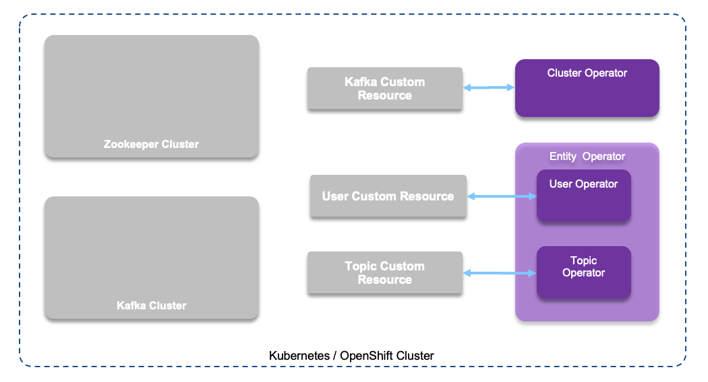

# Strimzi.io

[Strimzi](https://strimzi.io/) uses the Cluster Operator to deploy and manage Kafka (including Zookeeper) and Kafka Connect clusters. When the Strimzi Cluster Operator is up and runnning, it starts to watch for certain OpenShift or Kubernetes resources containing the desired Kafka and/or Kafka Connect cluster configuration. 



[strimzi.io/](https://strimzi.io/) offers the following capabilities:

* Deploy Kafka OOS on any OpenShift or k8s platform
* Support TLS and SCRAM-SHA authentication, and automated certificate management
* Operators for cluster, users and topics
* Manage kafka using gitops: See [vaccine-gitops environment/strimzi folder](https://github.com/ibm-cloud-architecture/vaccine-gitops/tree/main/environments/strimzi)

## Concept summary

The Cluster Operator is a pod used to deploys and manages Apache Kafka clusters, Kafka Connect, Kafka MirrorMaker (1 and 2), Kafka Bridge, Kafka Exporter, and the Entity Operator. When deployed the following commands goes to the Cluster operator:

```shell
# Get the current cluster list
oc get kafka
# get the list of topic
oc get kafkatopics
```

## Installation on OpenShift

The Strimzi operators deployment is done in two phases:

* Deploy the main operator via Subscription
* Deploy one to many instances of the Strimzi CRDs: cluster, users, topics...

For that we have define subscription and configuration in [this eda-gitops-catalog repo](https://github.com/ibm-cloud-architecture/eda-gitops-catalog). 
So below are the operations to perform:

```shell
 # clone 
 git clone https://github.com/ibm-cloud-architecture/eda-gitops-catalog.git
 # Define subscription
 oc apply -k kafka-strimzi/operator/overlays/stable/
 # The subscription creates an operator pod under the openshift-operators project
 oc get pods -n openshift-operators
 # Create a project e.g. strimzi
 oc new-project strimzi
 # deploy a simple kafka cluster with 3 brokers
 oc apply -k  kafka-strimzi/instance/
 # Verify installation
 oc get pods
 # should get kafka, zookeeper and the entity operator running.
```

The commands above, should create the following service account, resource definitions, roles, and role bindings:

| Names | Resource | Command |
| --- | :---: | --- |
| strimzi-cluster-operator | A [service account](https://kubernetes.io/docs/tasks/configure-pod-container/configure-service-account/) provides an identity for processes that run in a Pod. | oc get sa -l app=strimzi|
| strimzi-cluster-operator-global, strimzi-cluster-operator-namespaced, strimzi-entity-operator, strimzi-kafka-broker, strimzi-topic-operator | Cluster Roles | oc get clusterrole |
| strimzi-cluster-operator-entity-operator-delegation, strimzi-cluster-operator, strimzi-cluster-operator-topic-operator-delegation | Role binding | oc get rolebinding |
| strimzi-cluster-operator, strimzi-cluster-operator-kafka-broker-delegation | Cluster Role Binding | oc get clusterrolebinding -l app=strimzi |
| kafkabridges, kafkaconnectors, kafkaconnects, kafkamirrormaker2s kafka, kafkatopics, kafkausers | Custom Resource Definitions | oc get customresourcedefinition |

!!! Error
        In case of the installation fails with error like: " kafka.kafka.strimzi.io is forbidden: User "system:serviceaccount:eda-strimzi-21 :strimzi-cluster-operator" cannot watch resource "kafkas" in API group "kafka.strimzi.io" in the namespace "eda-strimzi-21 ", you need to add cluster role to the strimzi operator user by doing the following commands:
  ```shell
  oc adm policy add-cluster-role-to-user strimzi-cluster-operator-namespaced --serviceaccount strimzi-cluster-operator -n eda-strimzi-21
  oc adm policy add-cluster-role-to-user strimzi-entity-operator --serviceaccount strimzi-cluster-operator -n eda-strimzi-21
  ```


* Deploy Topic Operator, only if you want it to manage multiple cluster. If not then we need to add the configuration of the operator inside the Kafka Cluster yaml definition using [the EntityTopicOperatorSpec schema](https://strimzi.io/docs/operators/latest/using.html#type-EntityTopicOperatorSpec-reference):

  ```yaml
  entityOperator:
    # ...
    topicOperator:
      watchedNamespace: eda-strimzi-21
      reconciliationIntervalSeconds: 60
  ```

* Deploy user operator, same logic as above, apply. A standalone deployment means the Topic Operator and User Operator can operate with a Kafka cluster that is not managed by Strimzi.

## Validate cluster is running

* Send message

```shell
kubectl run kafka-producer -ti --image=quay.io/strimzi/kafka:0.21.1-kafka-2.7.0 --rm=true --restart=Never -- bin/kafka-console-producer.sh --broker-list eda-strimzi-kafka-bootstrap:9092 --topic test
```

* Consumer message

```shell
 kubectl run kafka-consumer -ti --image=quay.io/strimzi/kafka:0.21.1-kafka-2.7.0 --rm=true --restart=Never -- bin/kafka-console-consumer.sh --bootstrap-server eda-strimzi-kafka-bootstrap:9092 --topic test --from-beginning
```

## Defining topic

```shell
oc apply -f - <<EOF
apiVersion: kafka.strimzi.io/v1beta1
kind: KafkaTopic
metadata:
  name: transportation
  labels:
    strimzi.io/cluster: eda-strimzi
spec:
  partitions: 1
  replicas: 1
  config:
    retention.ms: 7200000
    segment.bytes: 1073741824

EOF
```

## Defining Users

Define a KafkaUser using yaml and then apply within the same namespace:

```yaml
apiVersion: kafka.strimzi.io/v1beta1
kind: KafkaUser
metadata:
  name: tls-user
  labels:
    strimzi.io/cluster: vaccine-kafka
spec:
  authentication:
    type: tls
  authorization:
    type: simple
    acls:
      - host: '*'
        resource:
          type: topic
          name: '*'
          patternType: literal
        operation: Write
      - host: '*'
        resource:
          type: topic
          name: '*'
          patternType: literal
        operation: Read
      - host: '*'
        resource:
          type: topic
          name: '*'
          patternType: literal
        operation: Create
      - host: '*'
        resource:
          type: group
          name: '*'
          patternType: literal
        operation: Read
```

```
oc get kafkausers
```

## Connect client apps

When defining the security control we want to set to access to the cluster we need to address the following questions:

* Do we need applications running outside of kubernetes to access Kafka, and do we need to load balance the TCP traffic?

    * For that we can use the HAProxy from Openshift via `Routes`. (Add the `external.type = route` stanza in the yaml file)
    * Load balancer
    * ingress with NGINX controller for kubernetes 

* What authentication to use: TLS or SCRAM-SHA-512?
* Integrate with OAuth2.0 for authentication and authorization using Open Policy agent
* Install your own certificates

The authentications used for user and Kafka need to match. Certificates are available in PKCS #12 format (.p12) and PEM (.crt) formats.

The internal URL name for the bootstrap can be found with: ``

For external access we need:


