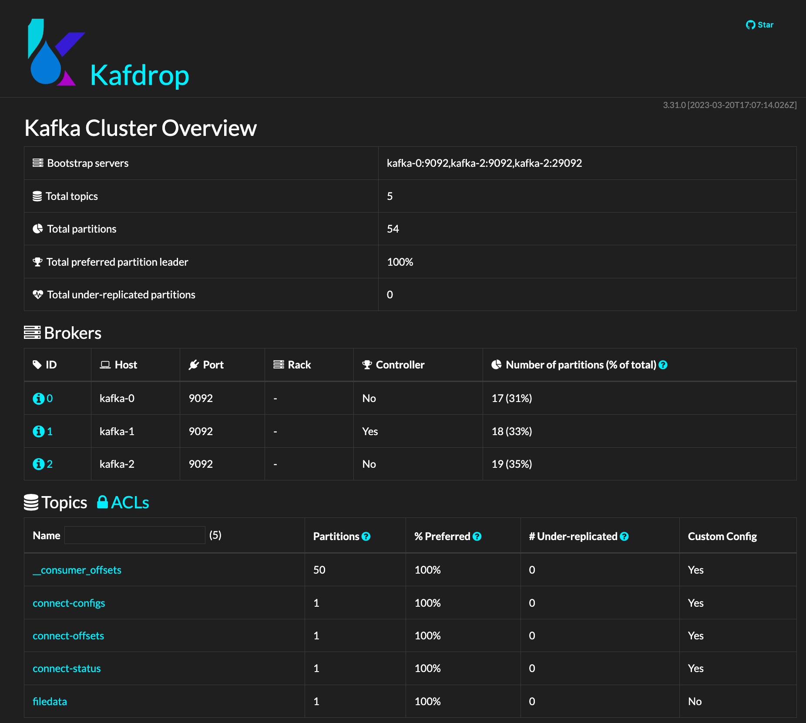

#  A  file source to topic to file demo with distributed kconnect


Created 8/2023.

## File Source to Topic to File Sink

The docker compose use a Kafka connect standalone mode. It declares one broker, one zookeeper, create a topic with the kafka script, and use Kafdrop as a user interface.

See the docker-compose.yaml for a kconnect connector: it mounts the local folder to /home/kafka/kconnect, and start the connect-standalone script:

```sh
"bin/connect-distributed.sh /home/kafka/kconnect/connect-distributed.properties"
```

The container needs to mount a logs folder to get the logs, and avoid an exception within the Kafka connect container.

The class is using the short name for FileStreamSource and Sink. 

```json
{
    "name": "local-file-source",
    "config": {
        "connector.class": "FileStreamSource",
        "tasks.max": 1,
        "file": "/home/kafka/kconnect/test.txt",
        "topic": "filedata"
    }
}
```

Adn for the sink. (The attribute is topics)

```json
{
    "name": "local-file-sink",
    "config": {
        "connector.class": "FileStreamSink",
        "tasks.max": 1,
        "file": "/home/kafka/kconnect/test.sink.txt",
        "topics": "filedata"
    }
}
```

## Demonstration

* Start the kafka cluster with a Kconnect cluster using `docker compose up -d`
* Deploy the source connector

```sh
curl -d @"source-connector.json" -H "Content-Type: application/json" -X POST http://localhost:8083/connectors
```

* Deploy the sink connector

```sh
curl -d @"sink-connector.json" -H "Content-Type: application/json" -X POST http://localhost:8083/connectors
```
* Use the API to get the connectors deployed:

```sh
curl http://localhost:8083/connectors
```

Or the detail from one of them

```sh
curl http://localhost:8083/connectors/local-file-sink

```

to get something like

```json
{"name":"local-file-sink","config":{"connector.class":"FileStreamSink","file":"/home/kafka/kconnect/test.sink.txt","tasks.max":"1","topics":"filedata","name":"local-file-sink"},"tasks":[{"connector":"local-file-sink","task":0}],"type":"sink"}%    
```

* Connect to Kafrop to at http://localhost:9000, and look at messages within the `filedata` topic

    

    The source connector has worked

* The sink connector has written to a new file.
* Add more lines to `test.txt` input file. When we do, we see that the source connector detects these changes automatically. We only have to make sure to insert a newline at the end, otherwise, the source connector won't consider the last line.
* Also deleting the sink file, and adding new lines in source file, will give the delta only.
