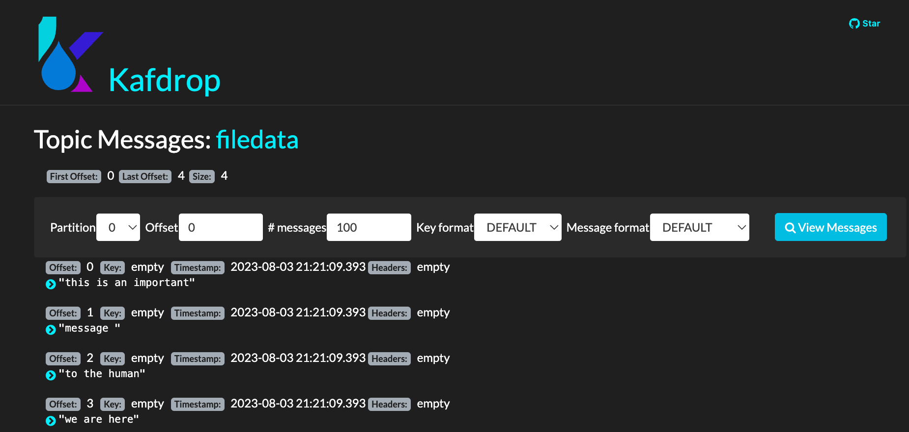

# A simple file source to topic to file demo

Created 8/2023.

## File Source to Topic to File Sink

The docker compose use a Kafka connect distributed mode. It declares 3 brokers, one zookeeper, create the topics with the kafka script, and use Kafdrop as a user interface.

See the docker-compose.yaml for a kconnect connector: it mounts the local folder to /home/kafka/kconnect, and start the connect-standalone script:

```sh
"bin/connect-standalone.sh /home/kafka/kconnect/connect-standalone.properties /home/kafka/kconnect/source-connector.properties /home/kafka/kconnect/sink-connector.properties"
```

The container needs to mount a logs folder to get the logs, and avoid an exception within the Kafka connect container.

The class is using the short name for FileStreamSource and Sink. 


Both connector configuration has a new attribute to specify the type of connector. This is new in Kconnect.

The source connector keep a row index from the source file, so modifying an existing row will not add a new message to the topic. 

## Demonstration

* Start the kafka cluster with a Kconnect cluster using `docker compose up -d`
* Connect to Kafrop to at http://localhost:9000, and look at messages within the `filedata` topic

    

    The source connector has worked

* The sink connector has written to a new file.
* Add more lines to `test.txt` input file. When we do, we see that the source connector detects these changes automatically. We only have to make sure to insert a newline at the end, otherwise, the source connector won't consider the last line.
* Also deleting the sink file, and adding new lines in source file, will give the delta only.
